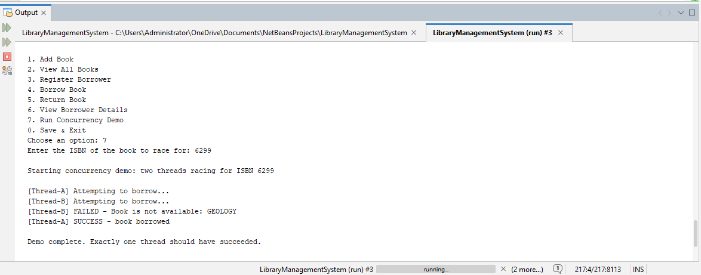
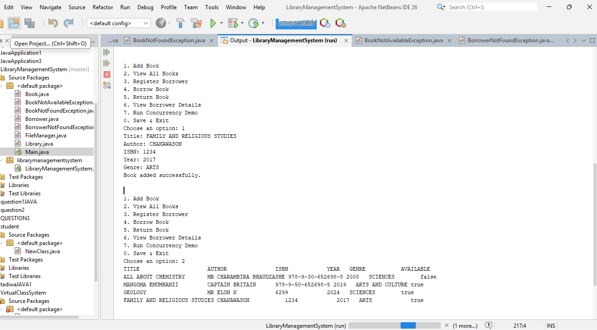
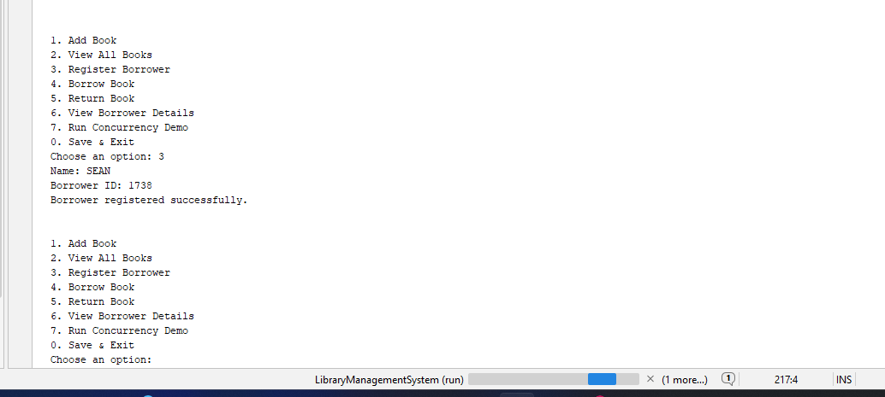
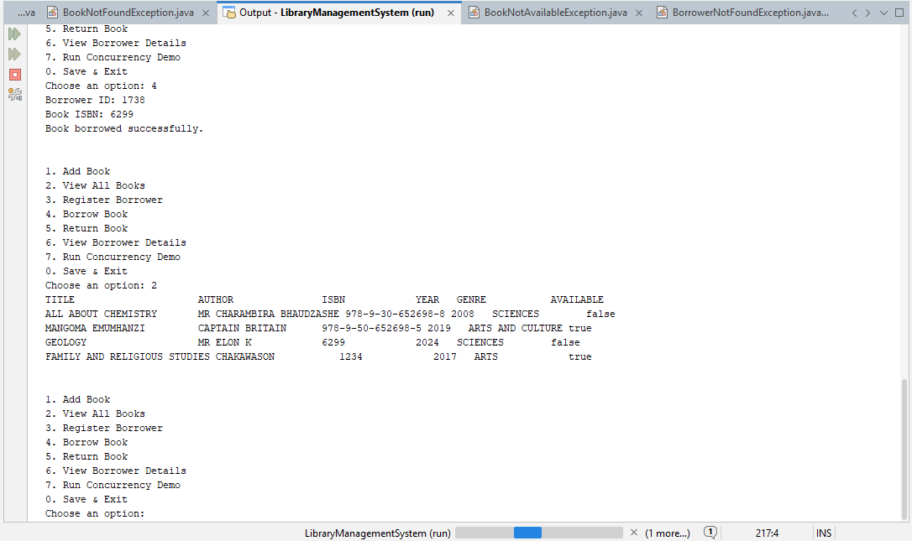
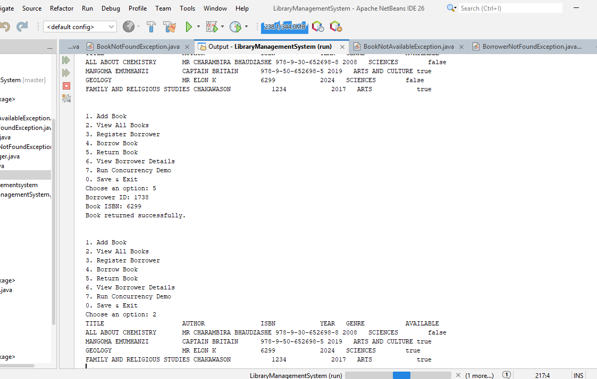
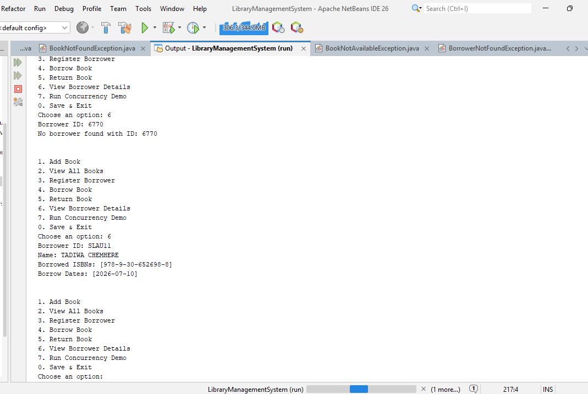

# Library Management System
 
A console based Library Management System built in Java, my first real portfolio project, and my attempt at going beyond the typical "add book, view book" university assignment.
 
## Why I built it this way
 
Most student library systems are one class with a switch statement bolted on. I wanted to build something closer to how a junior backend engineer would actually approach it, with proper separation of concerns, real error handling, and a genuine attempt at solving a hard problem instead of avoiding it.
 
That hard problem: **what happens when two people try to borrow the last copy of the same book at the exact same time?** Most student projects never even consider this. I wanted mine to.
 
## Features
 
- Add, view, and manage books (title, author, ISBN, year, genre)
- Register borrowers and track what they've borrowed and when
- Borrow / return books with proper validation
- Data persists to disk, close the program, reopen it, everything's still there
- A live, thread-safe borrowing system, see the concurrency demo below
## Architecture
 
I split the project into layers instead of dumping everything into one class:
 
```
Book.java / Borrower.java   → Data models (encapsulated, defensive copying)
Library.java                → Business logic + validation + concurrency handling
FileManager.java            → Reads/writes data to disk
Main.java                   → The console menu users actually interact with
*Exception.java             → Custom exceptions for business rule violations
```
 
Each class has one job. `Book` doesn't know or care how it gets saved. `Library` doesn't know or care how it gets displayed. That separation is what makes it possible to swap out `FileManager` for a real database later without touching anything else, which is genuinely the next thing I want to build.
 
## The concurrency problem (the part I'm proudest of)
 
Here's the scenario I set out to solve: two users try to borrow the last copy of the same book at the same moment. Without any protection, this is a classic race condition:
 
1. Thread A checks `isAvailable()` → `true`
2. Thread B checks `isAvailable()` → `true` (A hasn't updated the flag yet)
3. Both threads borrow the same book, and now your data is wrong
### How I fixed it
 
```java
synchronized (book) {
    if (!book.isAvailable()) {
        throw new BookNotAvailableException("Book is not available: " + book.getTitle());
    }
    book.setAvailable(false);
}
```
 
I locked on the specific `Book` object being borrowed, not the whole method. That means two people borrowing different books never block each other, only two people racing for the same book get forced to go one at a time. I chose this over locking the entire method because locking everything would've meant every borrow request queues up, even for completely unrelated books, which doesn't reflect how a real system should behave under load.
 
### Proof it actually works
 
I didn't want to just claim this works, so I built a menu option (7) that spins up two real threads and has them race for the same book live:
 

 
```
Starting concurrency demo: two threads racing for ISBN 6299
 
[Thread-A] Attempting to borrow...
[Thread-B] Attempting to borrow...
[Thread-A] SUCCESS - book borrowed
[Thread-B] FAILED - Book is not available: GEOLOGY
 
Demo complete. Exactly one thread should have succeeded.
```
 
Every time I run it, exactly one thread wins and one fails cleanly. Which one wins varies (that's up to the OS scheduler), but the outcome never breaks, no double-borrowing, no negative copy counts, no corrupted state.
 
## How I handled persistence
 
I saved data to plain text files (`books.txt`, `borrowers.txt`) instead of using Java's built-in serialization. This was a deliberate choice, not the easy default:
 
- I can open the files myself and see exactly what's saved, makes debugging way easier
- If I ever add a new field to `Book` later, old save files won't just break
- It's closer to how real systems actually handle structured text data
Since one borrower can have multiple borrowed books, I needed two levels of separators in `borrowers.txt`:
 
```
name,borrowerId,isbn1|isbn2|isbn3,date1|date2|date3
```
 
Commas separate the main fields, `|` separates multiple items within one field. Loading also checks for malformed lines and skips them instead of crashing, so a corrupted line doesn't take down the whole program.
 
## Error handling
 
I used custom exceptions for business rule violations instead of just returning null or printing an error and moving on:
 
- `BookNotFoundException`
- `BorrowerNotFoundException`
- `BookNotAvailableException`
These extend `RuntimeException` since they represent invalid operations (like trying to borrow a book that doesn't exist), not system-level failures, so I'm not forced to handle them at every single call site.
 
## Screenshots
 
**Adding a book and viewing the collection:**
 

 
**Registering a borrower:**
 

 
**Borrowing a book:**
 

 
**Returning a book:**
 

 
**Viewing borrower details (including error handling for an invalid ID):**
 

 
## Tech stack
 
- Java
- NetBeans
- `synchronized`, `Thread`, `Runnable` for concurrency
- Plain text file I/O , no external database or libraries
## Running it yourself
 
1. Clone the repo
2. Open it in NetBeans (or any Java IDE)
3. Run `Main.java`
4. Use the menu to add books, register borrowers, borrow/return
5. Try option 7 to watch the concurrency demo run live
## What's next
 
This is Phase 1 of a bigger roadmap I'm working through. Next up:
 
- Rebuilding this as a REST API with Spring Boot
- Moving persistence to a real relational database (PostgreSQL/MySQL)
- Adding role-based access (librarian vs. regular user)
- Automated overdue fine calculation via a scheduled task
## About me
 
I'm a final year IT: Software Engineering student building my way toward a junior developer role. This is my first personal project, built from scratch, debugged line by line, and something I can genuinely explain end to end.
 
[github.com/Slawu11](https://github.com/Slawu11)
